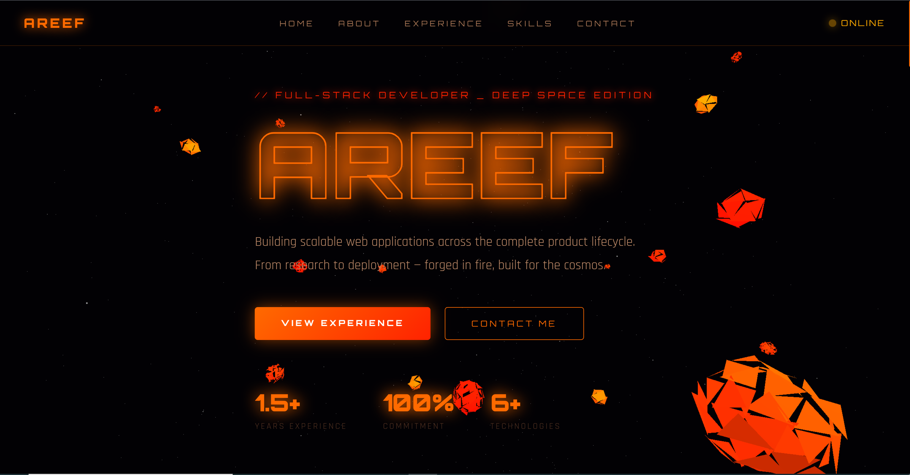
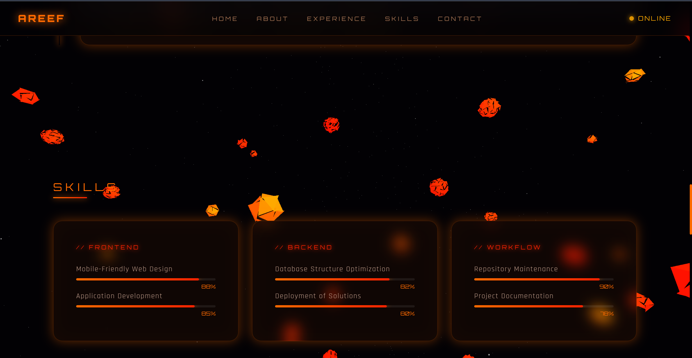

# areef-portfolio-inferno

> A deep space themed single-page developer portfolio featuring Three.js 3D tumbling asteroid rocks, fiery orange/red glassmorphism UI, emissive glow effects, and immersive scroll animations — forged in fire, built for the cosmos.




---

## 🚀 Live Demo

🌐 **[https://vaironix-inferno-portfolio.vercel.app/](https://vaironix-inferno-portfolio.vercel.app/)**

> Deployed on Vercel — no build tools or server required.

---

## ✨ Features

- **3D Tumbling Asteroid Field** — 120 Three.js IcosahedronGeometry rocks with displaced vertices, fiery emissive glow, and realistic tumbling physics falling through deep space
- **Star Field Background** — 3,000 white star points slowly rotating behind the asteroids
- **Dynamic Lighting** — Ambient + dual point lights in orange and red for fiery rock illumination
- **Mouse Parallax** — Camera tracks mouse position for an immersive depth effect
- **Glassmorphism UI** — Frosted glass cards with fiery orange glow borders throughout all sections
- **Glitch Hero Animation** — Name rendered with CSS glitch keyframes and fiery neon stroke
- **Scroll Reveal** — IntersectionObserver fade-slide animation on every section card
- **3D Card Tilt** — Perspective tilt effect on all glass cards triggered by mouse movement
- **Animated Skill Bars** — Fire gradient progress bars that animate into view on scroll
- **Floating Skill Orbs** — Floating pill tags with CSS keyframe levitation in orange/red/ember
- **Glowing Timeline** — Vertical experience timeline with animated pulsing dots
- **Contact Form** — Fully functional UI form with success feedback
- **Sticky Nav** — Fixed glassmorphism navbar with underline hover effect and live status indicator
- **Responsive Design** — Mobile-friendly layout with media query breakpoints
- **Custom Scrollbar** — Styled fiery orange scrollbar

---

## 🗂️ Project Structure

```
areef-portfolio-inferno/
├── index.html       # Full HTML structure — all sections
├── style.css        # All styles, fire theme CSS variables, animations, responsive
├── script.js        # Three.js 3D asteroid field, scroll reveal, tilt, form
├── image1.png       # Screenshot — Hero section
└── image2.png       # Screenshot — Sections overview
```

---

## 🛠️ Tech Stack

| Technology | Purpose |
|---|---|
| HTML5 | Semantic page structure |
| CSS3 | Glassmorphism, fire theme, animations, responsive layout |
| Vanilla JavaScript | Scroll reveal, tilt effect, form handler |
| [Three.js r128](https://threejs.org/) | 3D asteroid field, star field, dynamic lighting |
| [Orbitron](https://fonts.google.com/specimen/Orbitron) | Futuristic display font |
| [Rajdhani](https://fonts.google.com/specimen/Rajdhani) | Body and UI font |

---

## 🪨 Asteroid System — How It Works

```js
// Each asteroid is an IcosahedronGeometry with displaced vertices
// giving it a rough, irregular rock shape

const geo = new THREE.IcosahedronGeometry(radius, detail);
// Vertices displaced randomly for organic rock look

// Colors: fiery orange, red, ember yellow, deep red
const asteroidColors = [0xff6a00, 0xff2200, 0xffaa00, 0xff4500, 0xcc3300];

// Each rock has unique:
// - Size (0.08 to 0.43 units)
// - Fall speed (0.01 to 0.05)
// - Tumble rotation on all 3 axes
// - Emissive glow matching its color

// Asteroids reset to top when they fall below the view
if (mesh.position.y < -15) {
  mesh.position.y = Math.random() * 10 + 15;
}
```

---

## 📐 Sections

| Section | Description |
|---|---|
| **Hero** | Full-viewport name, tagline, CTA buttons, stat counters |
| **About** | Professional summary, contact info cards |
| **Experience** | Glowing vertical timeline — Alstonair (8 months) + Vaironix (6 months → Present) |
| **Skills** | Animated fire skill bars grouped by Frontend / Backend / Workflow + floating orbs |
| **Education** | B.Tech CSE — R S R Engineering College, 2023 |
| **Contact** | Message form + social links + location card |

---

## 🎨 Design System

```css
--orange: #ff6a00   /* Primary accent — fiery orange */
--red:    #ff2200   /* Secondary accent — deep red   */
--ember:  #ffaa00   /* Tertiary accent — ember yellow */
--dark:   #020104   /* Background — deep space black  */
```

**Fonts:** Orbitron (headings) · Rajdhani (body)

**Effects:** Glassmorphism · Fiery glow · Glitch animation · 3D asteroid field · Dynamic lighting · 3D tilt · Scroll reveal

---

## ⚡ Getting Started

No installation needed. Just clone and open.

```bash
git clone https://github.com/areef-shaik/areef-portfolio-inferno.git
cd areef-portfolio-inferno
# Open index.html in your browser
```

Or simply double-click `index.html`.

---

## 📸 Screenshots

| Hero | Experience |
|---|---|
|  |  |

---

## 🔁 Comparison with areef-portfolio-cosmos

| Feature | cosmos | inferno |
|---|---|---|
| Background | 6,000 particle universe | 120 3D tumbling asteroids |
| Color Theme | Cyan / Purple / Pink | Orange / Red / Ember |
| Lighting | None (emissive particles) | Ambient + dual point lights |
| Star Field | No | Yes — 3,000 stars |
| Mood | Futuristic neon space | Deep space fire & rock |

---

## 👤 Author

**Areef Shaik** — Full-Stack Developer

- 📧 areef.shaik0123@gmail.com
- 📞 +91 9110349362
- 🔗 [linkedin.com/in/areef-shaik3](https://www.linkedin.com/in/areef-shaik3/)
- 🐙 [github.com/AREEF3](https://github.com/AREEF3)

---

## 📄 License

This project is open source and available under the [MIT License](LICENSE).
